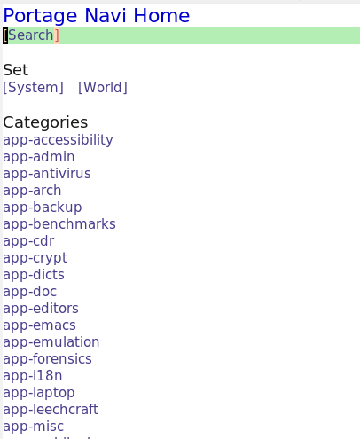
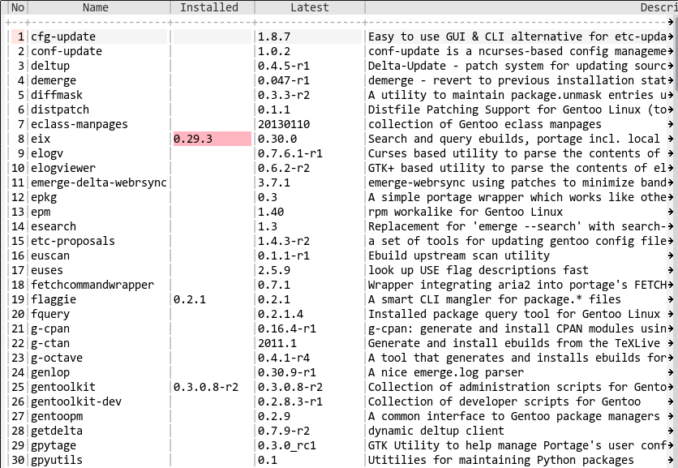
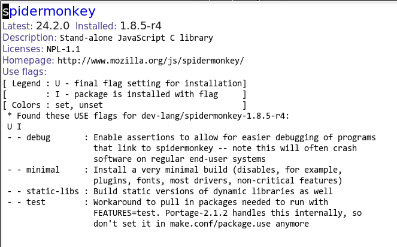

# Portage Navi

This program is a frontend GUI for portage, the great package manager.

The current status is under construction. Just viewing portage database.

[Home Buffer]


[Category List Buffer]


[Package Detail Buffer]


# Installation

## Package Installation

From MELPA, you can install this package as `portage-navi`.
(thanks @yasuyk!)

## Manual Installation

Place `portage-navi.el`, `deferred.el`, `concurrent.el` and `ctable.el` in your load path and add following code.

```lisp
(require 'portage-navi)
```

Then, try `M-x pona:open-home-buffer`.

# Usage

TODO

# License

Portage Navi is licensed under GPL v3.

----
(C) 2014 SAKURAI Masashi. m.sakurai at kiwanami.net
